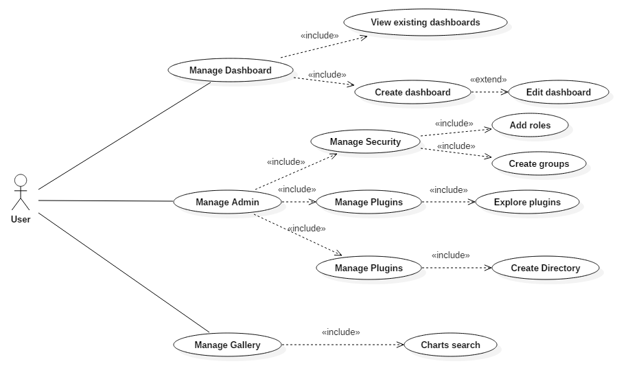

# Dashbuilder Requirements

## Contents
* [Dashbuilder Requirements](#dashbuilder-requirements)
	* [Introduction](#introduction)
	* [Requirements](#requirements)
		* [System Requirements](#system-requirements)
		* [Elicitation and Analysis](#elicitation-and-analysis)
		* [Specification](#specification)
		* [Validation](#validation)
		* [Use cases](#use-cases)
			* [Backends](#backends)
		* [Domain Model](#domain-model)
	* [Members and Contribution](#members-and-contribution)
		
## Introduction

The **requirements** is the first step in the software development. They are based in system characteristics in order to satisfy the client's needs, **elicitation**.
The second step is to process that information, and it goes through **analysis** and **specification** in which the requirements' documentation is done and verified. Finally, this stages are put all together and demonstrate that the requirements define what the customer really wants, **validation**.

## Requirements

### System Requirements

Dashbuilder requires a Unix base system(e.g. a Linux distribution or a Machintosh) or in case of Windows it requires a [Linux Bash Shell](http://www.howtogeek.com/249966/how-to-install-and-use-the-linux-bash-shell-on-windows-10/).
It also needs Java Runtime Environment version 1.6 (or more recent version), [Apache Maven](https://maven.apache.org/download.cgi) version 3.2.5 and [SuperDevMode](http://www.gwtproject.org/articles/superdevmode.html).

### Elicitation and Analysis

New features can be suggested essentially by everyone, however regular contributors are more influential. The suggestions and discussions of these features take place mostly in the [dashbuilder's IRC server](http://dashbuilder.org/help/chat.html) and in the [discussion forum](https://groups.google.com/forum/#!forum/dashbuilder-development), which later are merged upstream through the use of pull requests.

### Specification

Dashbuilder has a SRS (Software Requirements Specification) document and a user manual. [Here](http://dashbuilder.org/learn/documentation.html) you can find more about the dashbuilder, its features and the system requirements.
[Other documents](http://dashbuilder.org/learn/slides.html) are also available which provide a high-level overview of Dashbuilder's functional and [technical capabilities](http://dashbuilder.org/learn/screenshots.html).

### Validation

Besides there are planned upcoming features, the release schedule isn't very strict. Contributors can suggest new features which can prevail to the preview upcoming features, eventhough it is not easy to achieve. 
Those new features are subject to a Beta version before the final release.

### Use Cases

Dashbuilder, in order to read data from other sources, needs to extended. This is done through the use of extensions, in this case **backend**.
This type of extension is installed separately from Dashbuilder and it can extend the server's functionality in multiple ways.

#### Backends

The main purpose of a backend is to provide Dashbuilder more data, increasing its library size.

You, first, must create a **data provider** in order to gather information from any system, either a database, a file or any other and transform it to the internal in-memory representation for building dashboards.

### Domain Model

## Members and Contribution

Gustavo Faria	30%
	
Luis Spinola	10%	
	
João Duarte		30%
	
Nuno Pinto		30%
