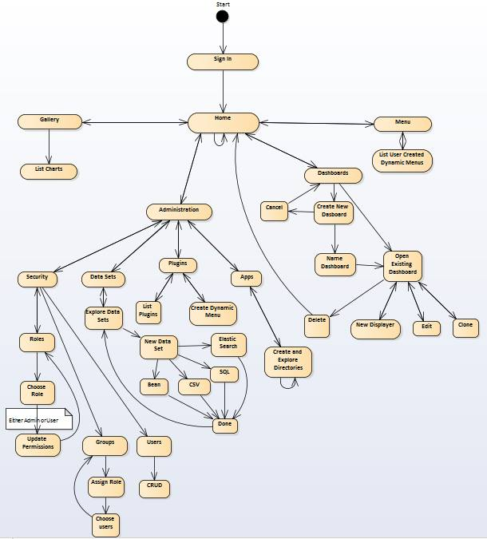
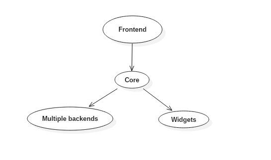

# Dashbuilder Software Architecture

## Contents
* [Dashbuilder Software Architecture](#dashbuilder-software-architecture)
	* [Introduction](#introduction)
	* [View Model](#view-model)
		* [Logical View](#logical-view)
		* [Implementation View](#implementation-view)
		* [Deployment View](#deployment-view)
		* [Process View](#process-view)
	* [Architectural Patterns](#architectural-patterns)
		* [Layered Architecture](#layered-architecture)
		* [Repository Architecture](#repository-architecture)
	* [Members and Contribution](#members-and-contribution)
		

## Introduction

Software architecture is the process of defining a structured solution that meets all of the technical and operational requirements of a software system.
It is usually represented using a set of views or perspectives in which the system's components are shown as well as its relationships to each other and the environment.

We will use the [**4 + 1 view model**](https://en.wikipedia.org/wiki/4%2B1_architectural_view_model) in order to describe Dashbuilder's architecture.

## View Model

The [**4 + 1 view model**](https://en.wikipedia.org/wiki/4%2B1_architectural_view_model) is based on the following views:

+ **Logical view** : The logical view shows the key abstractions in the system as object classes or their packages.
+ **Implementation view** : The implementation view shows how the software is decomposed (into components) for development.
+ **Deployment view** : The deployment view describes how the system hardware and software components are distributed.
+ **Process view** : The process view shows how the system is composed of interacting processes.

### Logical View

 
The dependencies here presented were deduced solely through analysis of the code's organization and from the different packages' summoning of each other. 
A couple of details stand out to the eye, one of which being the diferent disposition of child packages in the two packages that do possess such a characteristic. 
It is also possible to easily identify the "heart" of Dashbuilder's logic, by sheer amount of dependencies both the client and the dataset package earn that title.

### Implementation View

This view, also known as Development View, shows the program from the prespective of the programmer.

The frontend use the core interface and the core component.

The Dashbuilder is the core of the application. This component is responsible for the overall process. For every request from the frontend it calls out to the backend and/or the widgets. When the core get an answer, processes it and send a response to the frontend.

The backend is a set of data needed for the dashboard.

### Deployment View

Since Dashbuilder in itself is just a server, it doesn't have many requirements in order to run - Unix based system or a [Linux Bash Shell](http://www.howtogeek.com/249966/how-to-install-and-use-the-linux-bash-shell-on-windows-10/) in case of Windows, JRE 1.6 or higher, [Apache Maven](https://maven.apache.org/download.cgi) and [SuperDevMode](http://www.gwtproject.org/articles/superdevmode.html).

### Process View

## Architectural Patterns

### Layered Architecture

Dashbuilder has a layered architecture because its system is organized into layers, where each layer provides services to the layer above. Each layer can only interact with the layer directly below, that's why Dashbuilder has a **strict layered architecture**.

### Repository Architecture

All of Dashbuilder's source code and extensions are managed in a [central repository on GitHub](https://github.com/dashbuilder/dashbuilder) which is accessible to all system components, in this case developers. The repository accepts requests from components passively, it's called the passive variant.

## Members and Contribution

- Gustavo Faria		33,3%		
	
- João Duarte		33,3%
	
- Nuno Pinto		33,3%

