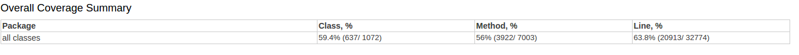
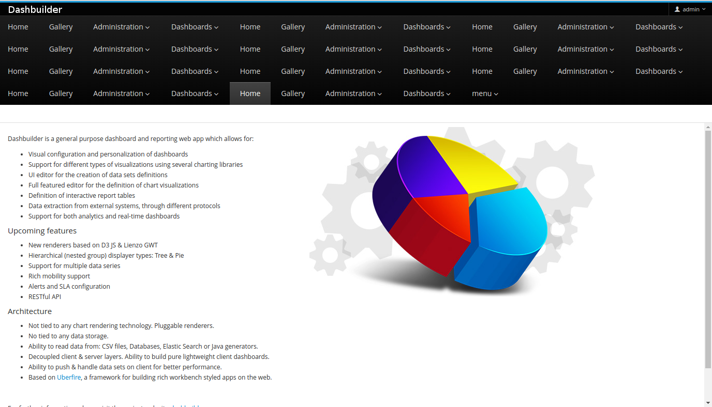

# Dashbuilder Software Verification and Validation

## Contents
* [Dashbuilder Software Verification and Validation](#dashbuilder-software-verification-and-validation)
    * [Introduction](#introduction)
    * [Degree of Testability](#degree-of-testability)
        * [Controllability](#controllability)
        * [Observability](#observability)
        * [Isolateability](#isolateability)
        * [Separation of concerns](#separation-of-concerns)
        * [Understandability](#understandability)
        * [Heterogeneity](#heterogeneity)
    * [Test Statistics](#test-statistics)
    * [Bug Report](#bug-report)
    * [Members and Contribution](#members-and-contribution)

	
## Introduction

Verifying a piece of software is to ensure that both the intermediate and final product conform to their specification and requirements.
On the other hand, to validate software is to make sure that the final product will fulfill its intended environment, mainly through the use of tests.

The main techniques used for verifying and validating (V&V) are **static techniques** and **dynamic techniques**:

- **Static techniques**: analyze the static system representations to both find problems/bugs and evaluate quality. This includes reviews, inspections, formal verification, etc.
- **Dynamic techniques**: execute the system and observe its behavior (software testing and simulation).

In Dashbuilder the software is constantly and consistently validated through the use of tools such as [Jenkins CI](https://jenkins.io/) which runs the test suite when code is pushed to the repository.

Contributions to the project are strict, as it is required to include tests for code/features in order to be accepted upstream.

## Degree of Testability

### Controllability

As described below in [Isolateability](#isolateability) the packages are very well organized and isolated which makes it very easy to control the state of a component as required for testing.
Those tests are mainly located in `backend` and `webapp` folders, which can be ran using intelliJ's Maven integration.

### Observability

Dashbuilder tests can be ran locally making use of [Apache Maven](https://maven.apache.org/) which gives us a complete view of the results as well as code coverage.
It also can be ran when doing a pull request, making use of [Jenkins CI](https://jenkins.io/) and its [Pipeline](https://jenkins.io/projects/blueocean/) to analyze test results and code coverage, which provides a graphical interface to analyze data.

### Isolateability

Dashbuilder has unit tests for most modules, mostly because each contribution must include tests in order to be accepted, which means that the isolateability is achieved because everything is confined in its module.

### Separation of concerns

Dashbuilder's source code is very well organized. Each module is separated into different folders, which makes it easy to understand what each module is responsible for. It also provides reliable documentation that specifies about its struture and makes it easier to contribute to the project.

### Understandability

Dashbuilder's test names alone are enough to accurately identify what component is being tested. Even though the test code is very well documented making it easy to understand the reach of the tests that are currently done and creating new ones for the said components.

### Heterogeneity

Dashbuilder tests can be ran locally making use of [Apache Maven](https://maven.apache.org/) and it also can be ran when doing a pull request, making use of [Jenkins CI](https://jenkins.io/) and its [Pipeline](https://jenkins.io/projects/blueocean/).

## Test Statistics

Running `mvn clean install` on the project's root directory results in an error halfway through, therefore indivudual packages had to be built independently. Luckily, intelliJ's Maven integration allows us to create a custom configuration so that unit testing and code coverage can be done on all successful packages at once. And these are the end results:

Test Results:

Most of these are unit tests, however, and solely located in package `org.dashbuilder.dashbuilder-backend.dashbuilder-dataset-sql-tests` are this project's [Integration Tests](https://en.wikipedia.org/wiki/Integration_testing).

For a full report visit:
- [Unit Test Report](http://htmlpreview.github.io/?https://github.com/fariagu/dashbuilder/blob/master/ESOF-docs/tests/testResults.html)
- [Code Coverage Report](http://htmlpreview.github.io/?https://github.com/fariagu/dashbuilder/blob/master/ESOF-docs/tests/CodeCoverage/index.html)

**Note:** Seeing as these aren't hosted webpages, in order to be properly viewed they can only be properly viewed locally.

## Bug Report

After careful study of the application's behaviour we discovered a series of steps that leads to an unwanted result. Therefore an issue was opened on this project's repository with its description so that the contribuitors are aware of its existence.

Here is an example of the bug:

[Here](https://github.com/dashbuilder/dashbuilder/issues/263) is the issue report.

Unfortunately we were not able to fix it.

## Members and Contribution

- Gustavo Faria		33,3%		
	
- João Duarte		33,3%
	
- Nuno Pinto		33,3%
