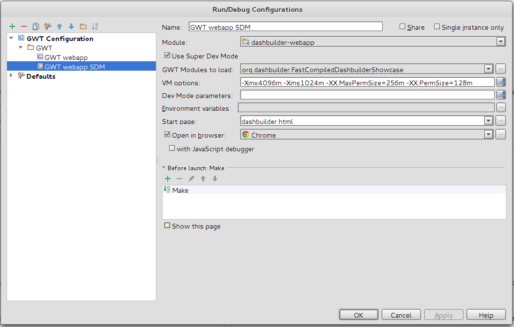

Dashbuilder
===========

Dashbuilder is a general purpose dashboard and reporting web app which allows for:

* Visual configuration and personalization of dashboards
* Support for different types of visualizations using several charting libraries
* Full featured editor for the definition of chart visualizations
* Definition of interactive report tables
* Data extraction from external systems, through different protocols
* Support for both analytics and real-time dashboards

Licensed under the Apache License, Version 2.0

For further information, please visit the project web site <a href="http://dashbuilder.org" target="_blank">dashbuilder.org</a>

Upcoming features
=================

* New renderers based on D3 JS, Lienzo GWT & Chart JS
* Hierarchical (nested group) displayer types: Tree & Pie
* Support for multiple dynamic data series
* Rich mobility support
* Alerts and SLA configuration
* RESTful API

Architecture
=================

* Not tied to any chart rendering technology. Pluggable renderers.
* No tied to any data storage.
* Ability to read data from: CSV files, Databases, Elastic Search or  Java generators.
* Decoupled client & server layers. Ability to build pure lightweight client dashboards.
* Ability to push & handle data sets on client for better performance.
* Based on <a href="http://www.uberfireframework.org" target="_blank">Uberfire</a>, a framework for building rich workbench styled apps on the web.

Change log
==========

0.3.0

* New provider for the definition of data sets stored into SQL databases.
* New provider for the retrieval of data stored into Elastic Search nodes.
* New displayer for showing single value metrics.
* Added new displayer subtypes: bar (stacked), pie (3d, donut), line (smooth)
* Support for real-time dashboards. Displayer refresh settings.

* New data set editor UI module:
    - Creation of SQL, Bean, CSV & elastic search data set definitions
    - Data set retrieval testing and preview
    - Filter, sort and export the data previews

* Displayer editor data set lookup enhancements:
  - Filter editor for retrieving only a data subset.
  - Time frame function for the retrieval of time series data in real-time.
  - Different strategies for grouping time series data.
  - Ability to add/remove the columns/series to display.

0.2.0

* Data set definition files: Support for CSV & Bean generated data sets
* Displayer Editor widget for the creation of displayer definitions
* Perspective editor integration which allows the creation of dashboards by drag&drop

0.1.1

* Notify clients about data set registration/removal events
* Assign an HTML identifier to every Displayer instance (useful for testing purposes)

0.1.0

Main goal of this very first release is to make it possible the creation of
composite dashboards using an straightforward API. Feature set:

* Shared API for defining and registering data sets
* Shared operation engine for executing filter, group & sort operations over a data set
* Client API & widgets for defining Displayer instances
* Uberfire wrapper screen for the Displayer widget
* Showcase App. providing a built-in displayer gallery plus some dashboard samples
* Default renderer based on the Google Visualization library
* Additional table renderer based on the Uberfire PagedTable widget
* Tomcat 7 and JBoss AS 7 distributions provided

Build & run
===========

Prerequisites
-------------
* Git client
* Maven 3.x 
* Java 1.6+

First steps
-----------

Clone the project

    git clone git@github.com:dashbuilder/dashbuilder.git
    
Now you can build & run the project in development or production mode.     

Development mode
----------------

Development mode allows a user to develop with the framework by compiling classes and client assets on runtime, which decreases the development time. There are more implications such as browser compatibilities, language support, etc. It's useful for developing and testing the application.                     

Dashbuilder is currently built using GWT 2.6.1, so uou can use both [hosted mode](http://www.gwtproject.org/doc/latest/DevGuideCompilingAndDebugging.html) or [SuperDevMode](http://www.gwtproject.org/articles/superdevmode.html) to run the application.             

**Hosted Mode** 

It's the "old" development mode that the GWT toolkit provides. Hosted mode has been removed in new GWT distributions and will be no longer used in future Dashbuilder releases.        

GWT hosted mode requires the <code>NSAPI</code> that is not present in modern browsers, so the GWT plugin for hosted mode is not available. So it's **important** to note that if you want to work with hosted mode, you have to use **old browser versions** that still support the <code>NSAPI</code> (and then support the GWT plugin), such as Firefox older than version <code>24</code>.                  

To build the application:

    cd dashbuilder
    mvn clean install -DskipTests

To run it:

    cd dashbuilder-webapp
    mvn gwt:run

Login:

    admin / admin

**SuperDevMode**

Super development mode is the new way to work in GWT since version <code>2.5</code> (Native support & the default mode in GWT <code>2.7</code>).                            

It works in most new browsers and it's based on [Source Map](https://docs.google.com/document/d/1U1RGAehQwRypUTovF1KRlpiOFze0b-_2gc6fAH0KY0k/edit?hl=en_US&pli=1&pli=1) spec. It's faster and more efficient than the old hosted mode. There are lots of benefits and other important reasons to use it, you can find more information [here](http://www.gwtproject.org/articles/superdevmode.html).             

Dashbuilder supports and it's configured by default to use SuperDevMode.                 

Using it means running two servers, one for the web application and one for the Code Server that compiles classes for SDM when the compile button is pushed on the web page or in the bookmark.

We **strongly recommend** to work in SuperDevMode using the GWT plugin for Eclipse or IntelliJ, as it sets the classpath and other parameters and it runs the server and the code server for you. If not, you can also run the server and the code server manually.         

**SuperDevMode - GWT IDE Plugin**

We recommend following these steps:

1.- Install GWT plugin for your IDE            

2.- Import dashbuilder project as a Maven project               

3.- If the IDE does not detect the GWT facets of the project, add it manually               

4.- Setup a new GWT run configuration with the SuperDevMode check enabled. See configuration example for IntelliJ:                    

5.- Run the configuration. It will start both servers and will launch the home page.

**SuperDevMode - Running servers manually**

1.- Run the HTTP server

Most common use is to run the hosted mode as it runs the embedded jetty server. So:               

    cd dashbuilder-webapp
    mvn gwt:run

2.- Run the GWT code server. 

    java -cp <CLASS_PATH> com.google.gwt.dev.codeserver.CodeServer org.dashbuilder.FastCompiledDashbuilderShowcase

NOTE: The classpath must contain all your GWT toolkit classes and all the classes required for compiling the Dashbuilder's GWT module. You can find an example [here](doc/gwt_code-server.sh).

Once code server is up you will see this message:
 
    The code server is ready.
    Next, visit: http://localhost:9876/

3.- Navigate to the code server URL (http://localhost:9876/) in a browser. It provides two bookmarklets (<code>Dev Mode On</code> and <code>Dev Mode Off</code>) that you have to drag and drop to the browser's bookmarklet bar.

4.- Navigate to your server page at 
    
    http://127.0.0.1:8888/dashbuilder.html

Probably a browser popup will appear with the following message "GWT Module may need to be (re)compiled". Just click on OK and discard the message.

5.- Click on "Dev Mode On" from your browser's bookmarklet bar and, if necessary, click on the compile button on the popup that appears and wait for compilation to finish.                
 
6.- Refresh the page and you will see the application.

Production mode
---------------

Production mode is used to build & package the application for a production environment. The application is compiled and the javascript assets are build using all permutations (browser support), all languages, etc.               

In order to build the production mode:

    cd dashbuilder
    mvn clean install -DskipTests -Dfull

Once build is finished, you'll find the WAR distributions for JBoss EAP/Wildfly and Tomcat into <code>dashbuilder/dashbuilder-distros/target/</code>.                
   
Just deploy the WAR file into your application server!                          
